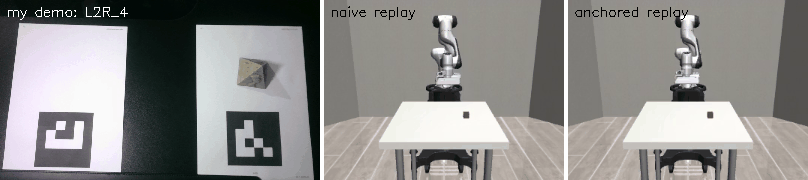
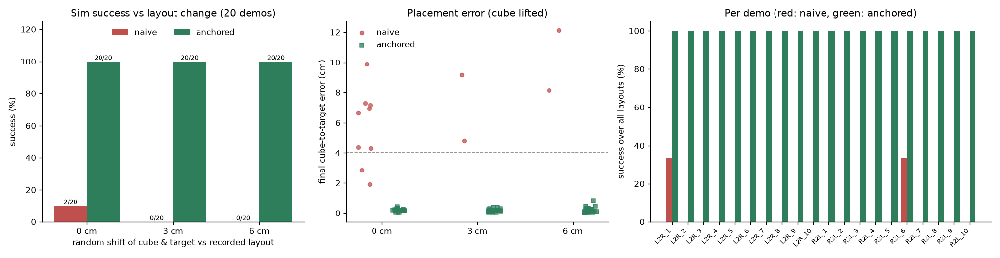
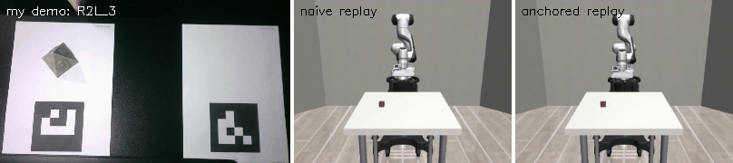
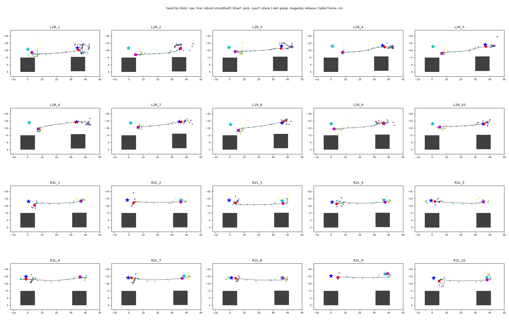
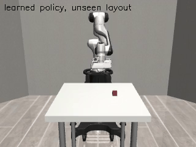
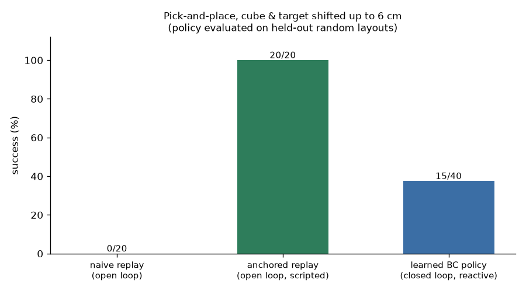

# Marker-anchored retargeting: 20 webcam demos → a simulated Panda

Intern challenge submission. I recorded **20 demonstrations** of myself moving a pyramid between
two printed ArUco markers (10 each direction). Each video becomes a camera-motion-free hand
trajectory in a metric **table frame**, which is retargeted onto a Franka Panda in MuJoCo/robosuite.
The robot uses OSC delta-pose + gripper actions, the same 7-D action space as LIBERO.



**Headline:** retargeting my 20 demos with *anchoring* gives 60/60 successful robot pick-and-places
(naive replay: 2/60). A behaviour-cloning policy trained on those replays then solves 38% of
**unseen** layouts closed loop, and I trace exactly why it fails on the rest.

## Results (all 20 demos)

| strategy | recorded layout | layout shifted ≤ 3 cm | layout shifted ≤ 6 cm | **total** |
|---|---|---|---|---|
| naive (metric replay of my hand path) | 2/20 | 0/20 | 0/20 | **2/60 (3%)** |
| **anchored** (my path, contacts pinned to object & goal) | 20/20 | 20/20 | 20/20 | **60/60 (100%)** |



Success means the cube was lifted more than 3 cm and then came to rest within 4 cm of the target.
The median final placement error is **0.2 cm** for anchored replay and **6.7 cm** for naive replay.
Full per-clip numbers (tracking coverage, contact errors, success) are in
[`out/sim/summary.md`](out/sim/summary.md). There is a replay video for every clip in
[`out/sim/videos/`](out/sim/videos/).

**Takeaway:** a cheap, hand-model-free tracker gets my hand to within a few centimetres. That is
not good enough to drive a gripper directly (naive: 3%). Anchoring the human trajectory to the
object and goal keeps the demonstrated motion and timing while removing the error, and the same
mechanism lets a single demo generalise to new layouts (anchored: 100%, even with the cube and
target moved up to 6 cm).



## How it works
A moving camera makes raw hand pixels meaningless. Two flat markers give a per-frame homography
from image to table plane, so every frame becomes the same rectified top-down view in cm.

1. **Auto-calibration** (`track_hand.py`). The left marker defines the table frame. The right
   marker's corners are measured in that frame through the left marker's own homography, taking the
   median over all frames. Nothing is measured by hand. It recovered 34.9–35.9 cm spacing,
   consistent across all 20 clips.
2. **Object start/end.** I diff the first and last rectified frames and keep only object-sized
   blobs. The pick is the blob that is darker at the start, so both directions work.
3. **Hand path.** I take the foreground that differs from *both* the start and the end scene, which
   removes the static object "ghosts". The tip is the blob point farthest from where the arm enters.
4. **Contacts.** Grasp and release are the closest approaches of the outlier-robust smoothed tip
   (rolling median → interpolation → light Savitzky-Golay) to the pick and place points.
5. **Digital twin + retargeting** (`sim_replay.py`). The sim cube starts where my pyramid started,
   and the target is where it ended.
   * **naive** maps table cm → sim m with one fixed rigid transform and executes my path as is.
   * **anchored** applies the same transform, then a 2-D similarity warp that pins my grasp point onto
     the cube and my release point onto the target. Path shape, approach direction and timing in
     between are still mine. The same warp retargets a demo onto *new* layouts (`--perturb`), as a
     MimicGen-style augmentation.
6. **Height.** The view is top-down and monocular, so z is not observable. It is synthesised by
   distance-gated descent: the gripper hovers 12 cm up and descends as the path converges on the next contact.

## Run it
**Colab:** open [`colab_pipeline.ipynb`](colab_pipeline.ipynb) on a T4 GPU runtime and run all cells
(about 25 min). The notebook creates its own Python 3.12 environment, because MuJoCo 3.3 / robosuite 1.5
have no prebuilt packages for newer Pythons.

**Local (Python 3.10–3.12):**
```bash
pip install -r requirements.txt
export MUJOCO_GL=egl PYOPENGL_PLATFORM=egl
python run_pipeline.py --quick --clips L2R_1            # smoke test, 1 min
python run_pipeline.py --perturb 0 3 6 --seeds 1 --no-rollouts   # the experiment above
```

| step | script | output |
|---|---|---|
| video → table-frame trajectory + contacts | `track_hand.py` | `out/<clip>/traj.npz`, `out/<clip>/rectified_montage.jpg` |
| trajectory → Panda waypoints | `retarget.py` | `wp/<clip>_{naive,anchored}.npz` |
| sim replay + scoring (+ VLA rollouts, + policy training states) | `sim_replay.py` | `out/sim/json/`, `out/sim/videos/`, `rollouts/` |
| tables / figures / GIFs | `summarize.py`, `make_media.py` | `out/sim/summary.{md,png}`, `out/tracks.png` |
| everything above | `run_pipeline.py` | |
| learned policy: data → train → closed-loop eval | `run_policy.sh` (`policy.py`, `train_policy.py`, `eval_policy.py`) | `states/`, `out/policy/` |

Without `--no-rollouts`, every successful anchored episode is also saved as VLA training data:
the `agentview` and `wrist` images (128×128), the 9-D proprio state, the 7-D action and the
language instruction.

## Data
20 webcam clips in [`data/`](data/) (1080p, about 16 fps, 3–7 s each), filmed looking down at a desk
with two printed 4×4 ArUco markers (IDs 0 and 1, 10 cm). `L2R_1–10` and `R2L_1–10` give the
direction **from my viewpoint**. I sit opposite the camera, so `L2R` moves the pyramid right → left
in the image. Both markers are detected in essentially every frame of every clip.



## What worked
* **Markers as a moving-camera anchor plus auto-calibration.** There are no hand measurements,
  and the rectified view removes camera shake completely.
* **The object is the most reliable signal.** Pick and place come from the scene diff, not the hand.
* **Anchoring.** It turns a 3% pipeline into a 100% one, and it generalises to shifted layouts for free.

## What didn't (and what I changed)
* **There is a systematic hand-pose bias.** I use my right hand, so at the *left* spot my fingers
  reach past the pyramid, and the "farthest fingertip" lands 5–8 cm from the object. The contact
  error averages **4.8 cm at the left spot versus 1.2 cm at the right spot**. This is the main reason
  naive replay fails, and anchoring absorbs it. A learned hand-keypoint model would fix it at the
  source.
* **MediaPipe.** The current MediaPipe has dropped its legacy hand API, and its model download was
  blocked in my build environment. Rather than depend on it, I built the hand-model-free tracker
  above. The cost is no pinch aperture and no height, so grasp timing comes from contact proximity.
* **The printed markers are rotated 180° in the image.** My first homography was distorted until
  marker orientation was measured. Auto-calibration now handles any rotation.
* **Plain Savitzky-Golay smoothing over outlier-prone tracks shifted contacts by up to 11 cm.** I
  switched to robust smoothing and detect contacts on the smoothed track.
* **Shadows and lighting changes** were mistaken for the object, so blobs must now be object-sized.
* **Fast clips** (`R2L_*` are about 3 s long) give fewer hand frames (median: the hand is visible in
  55% of frames).
* **LIBERO itself** pins old numpy/robosuite versions that don't build on Python ≥ 3.13. I used
  robosuite 1.5, the simulator LIBERO is built on, with the same Panda, OSC controller and action
  convention. Porting means swapping `make_env` and the object/target poses.
* **Honest caveat.** Anchored success is partly by construction, because the sim knows the cube and
  target poses, so the contact points are exact. What the experiment shows is that my *recorded path
  shape, timing and gripper schedule* turn into feasible robot motion, and that tracking error alone
  makes a direct replay fail. A learned policy has to find the cube itself (see next).

## Next: SmolVLA
Run `run_pipeline.py` without `--no-rollouts` to produce image + proprio + action episodes. Convert
them to a LeRobot dataset, fine-tune `lerobot/smolvla_base`, and evaluate base vs fine-tuned at layout
shifts of 0, 3 and 6 cm.

## Learned policy: behaviour cloning on my demos

The anchored replays are scripted: they are told where the cube and target are, and they follow
my recorded path. To get a **reactive policy**, I trained one on those replays and let it control
the robot by itself.





| | naive replay | anchored replay | **learned BC policy** |
|---|---|---|---|
| control | open loop | open loop, scripted | **closed loop, reacts every step** |
| success, layouts shifted ≤ 6 cm | 0/20 | 20/20 | **15/40 (38%)** |

* **Data.** I ran anchored replays of all 20 demos, each on 6 random layouts (≤ 6 cm shift), giving
  117 successful episodes and about 40k steps. They use DART-style noise: the robot executes noisy
  actions while the label stays the clean one, so the data also covers recovering from small
  mistakes.
* **Model** (`train_policy.py`). A goal-conditioned MLP (3×256). Its input is 12-D state:
  end-effector position, gripper, cube relative to the end-effector, target relative to the
  end-effector, and cube relative to the target. Its output is a 4-D action (dx, dy, dz, gripper)
  in the same OSC action space as above. It trains in about 90 s on CPU. Whole demos (`L2R_10`,
  `R2L_10`) are held out for validation, where it reaches 98% gripper accuracy.
* **Evaluation** (`eval_policy.py`). Closed loop on 40 layouts drawn with **held-out random seeds**,
  450 steps (22 s) each. Episodes terminate on success, as in LIBERO. When it succeeds it places
  the cube with a **median error of 0.6 cm**, after about 10 s. Two independent 40-episode runs
  gave 15/40 and 16/40; robosuite randomises the robot's start pose, so runs differ slightly.
* **Reproduce:** `bash run_policy.sh` (about 30 min on 2 CPUs).

### What I learned from the failures
Almost every failure (22 of 25) is "never grasped". I traced individual episodes step by step:

1. **Gripper decision on the fence.** The replay starts closing the gripper only *after* arriving,
   so "at the cube, gripper open" is labelled both open and close. The regressor averaged them and
   sat at −0.08 forever, just below the close threshold. *Fix:* anticipatory gripper labels, where
   each open/close switch is labelled 0.25 s earlier. This cured those episodes, but the overall
   rate stayed the same (10/20 before and after on the same 20 layouts), because…
2. **Stalls from averaging multimodal demonstrations.** Near the cube my recorded paths wobble in
   different directions in different demos. A single-step regressor averages them into roughly zero
   motion, and the arm hovers 1–4 cm above the cube.
3. **No notion of "done".** After placing, the scene can look like a fresh pre-grasp state, and the
   policy sometimes picks the cube up again.

All three are known limits of single-step behaviour cloning, and they are exactly what
**action-chunking, generative policies** (ACT, Diffusion Policy, and SmolVLA's flow-matching action
expert) are designed to fix. So the natural next step is to train SmolVLA on image versions of the
same rollouts (`run_pipeline.py` without `--no-rollouts`). Its policy would also have to find the
cube from pixels instead of being given its position.
